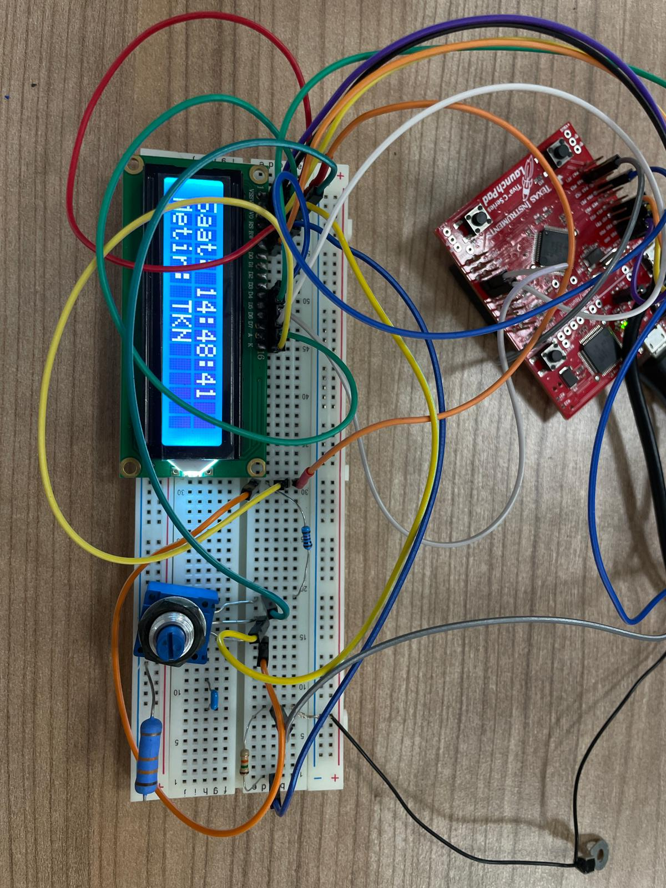
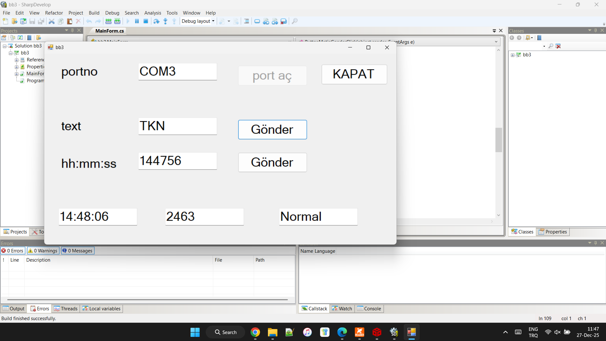

Yapılan grafiksel kullanıcı arayüzü C# Windows Forms altyapısı kullanılarak tasarlanmış olup Tiva C mikrodenetleyicisi ile UART protokolü üzerinden çift yönlü bir haberleşme sağlamaktadır. Yazılım mimarisi, olay güdümlü bir yapı üzerine inşa edilmiştir. PC'den mikrodenetleyiciye veri akışı kullanıcı tetiklemeli butonlar aracılığıyla sağlanmakta ve gönderilen veri paketleri hedef donanımın komut setine uygun bir header + veri formatında (Örnek olarak: 'Z' + Saat Bilgisi) kapsüllenerek seri porta yazılmaktadır. Ters yöndeki veri akışı ise asenkron olarak yönetilmektedir. Mikrodenetleyiciden periyodik olarak gelen veriler (Sistem saati, ADC değeri ve GPIO durumu) arayüz tarafındaki DataReceived olayı (event handler) tarafından yakalanmakta ve UI Thread'i bloklamadan işlenmektedir. Alınan ham veri paketi, delimiter tabanlı bir ayrıştırma algoritması ile işlenerek sayısal değerlere dönüştürülmekte ve ilgili gösterge panellerinde gerçek zamanlı olarak görselleştirilmektedir.

# Odev4_Serial_GUI

## Devre Şeması

## Proje Fotoğrafları

